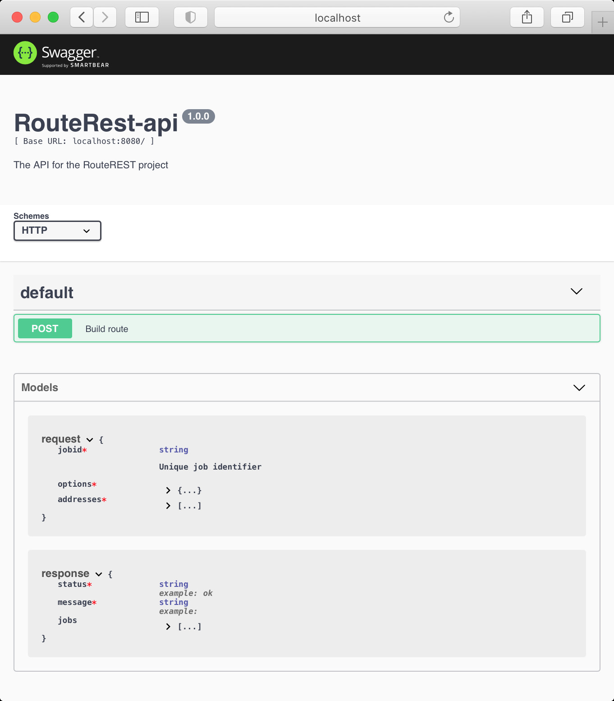

# NodeJS Swagger REST Service for PostgreSQL Routing Engine



# Postman scripts

## Body
```
Label	X	Y
1	34,8880680060821	32,0842256572237
2	34,8886902785736	32,0819553511971
3	34,9003642148498	32,0822614228932
4	34,8969975092621	32,0835313342153
5	34,8958918037048	32,085445814498
6	34,8946362	32,0746375
7	34,8985390247451	32,0784711497842
8	34,9119700872413	32,0773765559989
9	34,886645268856	32,0762800112216
10	34,9002615	32,0851901
11	34,8930654	32,0812325
Destination	34,8467975066375	32,0504532186704
```

## Pre-Request Script
```
let bodyText = pm.request.body.raw;
let lines = bodyText.split(/\n/);
let addresses = lines.map((line, idx)=>{
    if(idx===0) return null;
    let lineArr = line.split(/\s/);
    if(lineArr.length!==3) return null;
    console.log(lineArr);
    return {
        "lat": Number.parseFloat(lineArr[2].replace(",",".")),
        "lon": Number.parseFloat(lineArr[1].replace(",",".")),
        "description": ""+lineArr[0]
      };
}).filter(address=>{
    if(address===null) return false;
    return true;
});

console.log(addresses);

let body = {
    mode: 'raw',
    raw: JSON.stringify({
    "jobid": "postman",
    "options": {
        "vehicle": "Car",
        "optimize": true,
        "trip": "Stop",
        "vehicleprofile": "Auto",
        "tolerance": 10,
        "debug": false,
        "turn_cost": true
    },
    "addresses": addresses,
  }),
    options: {
        raw: {
            language: 'json'
        }
    }
};

pm.request.body.update(body);
```

## Tests
```

var template = `
<link rel="stylesheet" href="https://unpkg.com/leaflet@1.7.1/dist/leaflet.css" />
<script src="https://unpkg.com/leaflet@1.7.1/dist/leaflet.js"></script>
<script src="https://cdnjs.cloudflare.com/ajax/libs/wicket/1.3.6/wicket.min.js"></script>
<style>
.my-div-icon{
    background: black;
    border-radius: 6px;
    padding: 8px;
    color: white;
    display: flex;
    justify-items: center;
    align-items: center;
    width: auto !important;  
}
.my-div-icon .my-div-span{
        white-space: nowrap;  
        
        }
</style>

<div id="mapid" style="height: 500px; min-width: 310px; max-width: 800px; margin: 0 auto; padding: 20"></div>

<script>
    var mymap = L.map('mapid').setView([51.505, -0.09], 13);
    L.tileLayer('https://tile.openstreetmap.org/{z}/{x}/{y}.png	', {
        attribution: 'Map data &copy; <a href="https://www.openstreetmap.org/copyright">OpenStreetMap</a> contributors, Imagery © <a href="https://www.mapbox.com/">Mapbox</a>',
        maxZoom: 18,
        id: 'mapbox/streets-v11',
            tileSize: 512,
        zoomOffset: -1,
        accessToken: 'your.mapbox.access.token'
    }).addTo(mymap);
pm.getData(callback)
// console.log("response", response);

function callback(e,d){
    console.log(e,d);
    if(!e){
        d.response.map(item=>{
            console.log(item);
            if(item.info && item.info.route && item.info.route.length>0){
                var wicket = new Wkt.Wkt();
                wicket.read(item.info.route);
                console.log(wicket);
                var feature = { "type": "Feature", 'properties': {}, "geometry": wicket.toJson() };
                var p = L.geoJson(feature).addTo(mymap);
                mymap.fitBounds(p.getBounds());

            }
            item.addresses.map(address=>{
                console.log(address);
                var wicket1 = new Wkt.Wkt();
                wicket1.read(address.point);
                var description = address.sequence + " ("+address.description+")";
                // var feature1 = { "type": "Feature", 'properties': {}, "geometry": wicket1.toJson() };
                // var k = L.geoJson(feature1);
                // console.log(wicket1.toJson());
                var p = new L.Marker([wicket1.toJson().coordinates[1],wicket1.toJson().coordinates[0]]).bindTooltip(description, 
                    {
                        permanent: true, 
                        direction: 'right'
                    }
                );;
                console.log(p);
            p.addTo(mymap);
            // p.setContent(description);
            })
            mymap.fitBounds(p.getBounds());

            // mymap.fitBounds(r.getBounds());
        });
    }
    

    // https://raw.github.com/mapbox/wellknown/master/wellknown.js

}

</script>
`;

pm.visualizer.set(template, {
    // Pass the responses you need in a single JSON as data
    response: pm.response.json()
});
```
